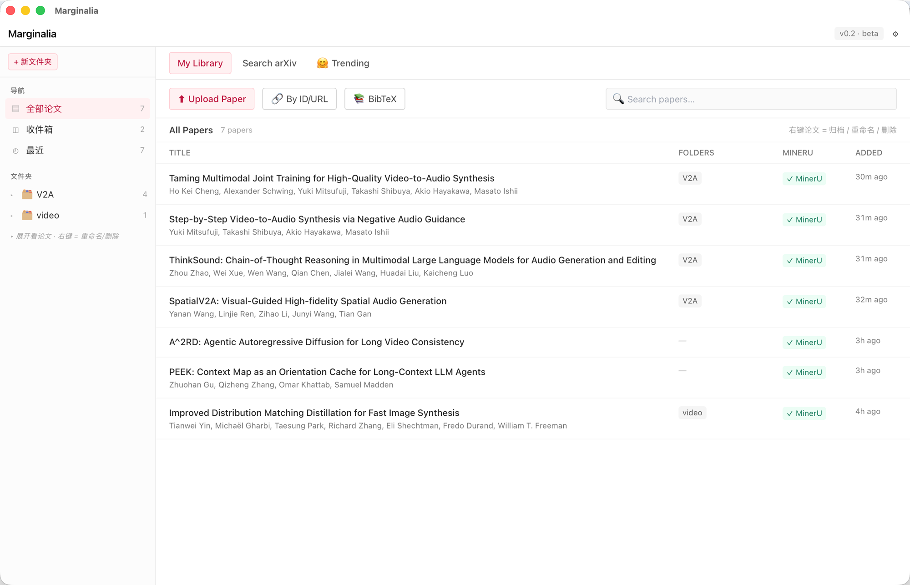
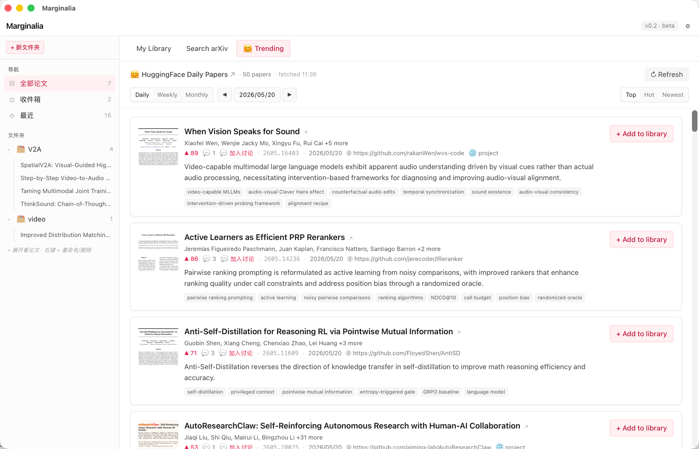
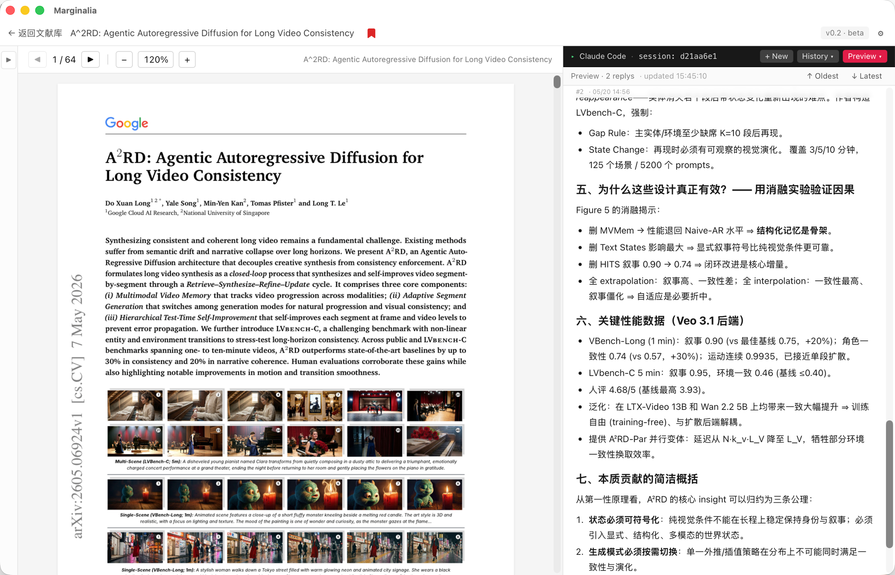

# Marginalia

> 把论文放左边，把 Claude Code 放右边。
> 让阅读和推理变成一个流畅的回路。

[**⬇ 下载 v0.5.0**](https://github.com/chenhaoqcdyq/marginalia-releases/releases/latest) ·  macOS · Apple Silicon + Intel · [English README](README_EN.md)

---

## 🆕 News — v0.5.0（2026-05-24）

PDF 内**引用卡片**+ 对话 **Preview 重设计**。点 `[N]` 就地浮出论文卡片
（标题、参考文献全文、首页缩略图、Jump、Bookmark、应用内打开）；点
`Figure 3` / `Table 2` 直接跳图体，自带"← 返回上一位置" pill。
[完整 release notes →](https://github.com/chenhaoqcdyq/marginalia-releases/releases/tag/v0.5.0)

- 🎯 **点 [N] 浮出卡片**：不再跳走、不再丢上下文。卡片随 PDF 滚动/
  缩放跟随，ESC 或点外部消失。
- 🧠 **智能识别 Figure / Table / Section / Algorithm / Theorem**：
  非参考文献的跨页链接直接跳目标（且自动上移 ~320pt 让图体进入视口，
  而不是只看到 caption），并在右上角浮一个 ← Back to page N pill。
- 🖼 **卡片左侧首页缩略图**：本地库命中秒出，未命中走 arXiv 下载（流式
  进度条），结果磁盘缓存。
- ➡ **红色 → 按钮：应用内打开**这篇引用论文（已在库 → 聚焦旧窗口；
  不在库 → 下载 + 入库 + 开新 reader 窗口）。Loading overlay 带真实
  进度条和取消按钮，10MB 下载也不会把你卡死。
- 🔖 **卡片内 Bookmark**：选已有文件夹或现场新建一个，原子化入库 + 关联
  文件夹。
- 📚 **引用解析**：MinerU 的 paper.md 被解析成有编号的参考文献表；卡片
  通过目标位置文本反查 `[N]` 条目（避开了源文本 `[9, 10, 11]` 簇的
  误判）。
- 💬 **Preview 重设计**：用户问题改成右对齐玫红色聊天气泡 `Q1 / Q2`
  编号，与 markdown assistant 回答有明显视觉区分；导航按钮换成
  `« ‹ › »` 图标，`‹ Prev Q` 智能两段式（先回到当前问题开头，已在
  开头则跳上一问题）；自动过滤 `<system-reminder>` / tool_result /
  hook 注入的"伪用户消息"。
- 🛠 **PDFView 生命周期修复**：返回文献库现在原子从视图树移除 PDFView
  （之前某些合成路径下会残留上一篇论文的页面），再次打开论文时
  pending frame 也会重新应用。
- ⚙ **Tauri 多 webview 适配**：所有可能在卡片浮层出现后被主 reader 调
  到的命令统一换成 `tauri::Webview` 参数（`WebviewWindow` 在多 webview
  窗口上会报 "current webview is not a WebviewWindow"）。

---

## 🆕 News — v0.4.0（2026-05-22）

macOS 原生 **PDFKit 渲染器**成为默认，附带完整标注层。
[完整 release notes →](https://github.com/chenhaoqcdyq/marginalia-releases/releases/tag/v0.4.0)

- 🖥 **PDFKit 默认开启**：丝滑捏合 / 滚动、原生选区、内存更低、各缩放
  级别都清晰；PDF.js 作为跨平台后备。
- 🖍 **标注**：选区 → 7 色调色板 → 可选笔记 → Highlight，存到
  `~/.alphaxiv++/papers/<id>/annotations.json`，下次打开真·PDFAnnotation
  重绘。点击已有 highlight 加载回 ribbon 编辑/删除，⌘↵ 保存。
- 🎈 **Hover marginalia 气泡**：鼠标停留 highlight 时在 PDF 列右侧弹出
  小气泡显示页码、选区预览、笔记。
- 💡 **Ask AI 按钮**：标注 ribbon 上一键把选区 + 笔记写入
  `current_selection.md`，让下一条 Claude prompt 自动带上下文。
- 🧰 修复：PDFView 不再遮 React header（contentLayoutRect Y 翻转 bug）；
  objc2 0.6 NSString 转换 panic；"返回文献库"后点同篇论文重新进 reader。

---

## 🆕 News — v0.3.0（2026-05-21）

最新大版本带来 HF Daily 体验重做、搜索源扩展、智能缓存和论文打开零等待。
[完整 release notes →](https://github.com/chenhaoqcdyq/marginalia-releases/releases/tag/v0.3.0)

- 🤗 **HF Daily 全新面板**：Daily / Weekly / Monthly 范围切换、Top / Hot /
  Newest 排序、日期 ◀▶ 翻历史、提交人头像、💬 加入讨论、缩略图点击放大、
  摘要展开、关键词点击过滤。设置里可填可选的 HuggingFace token。
- ⚡ **按天共享缓存 + 后台预取**：跑完 Monthly 后，切到 Weekly / Daily 0 网络
  请求。HF 面板挂载时每 10 分钟静默刷新 today。
- 🔎 **OpenAlex 加入搜索（默认）**：2.5 亿篇论文，无 key，100k 次 / 天 / IP，
  比 arXiv / Semantic Scholar 都宽松。
- ⚡ **点击 trending 论文 0 等待**：reader 立即出现 + 占位"下载中"，PDF
  和数据库写入在后台跑。
- 🔄 **状态全记住**：Library / Search / Trending 三个标签页各自记滚动位置、
  上次搜索/筛选状态；侧栏 All / Inbox / 文件夹点击自动切回 My Library。
- ⚙ **设置面板重设计**：气泡式卡片，网络诊断 2 列卡片网格（绿/红状态点 +
  延迟徽章 + 可展开报错），手动代理设置即时生效。
- 🖼 **PDF 渲染清晰度可调**（默认 2× = Retina 原生，匹配 macOS 预览）；
  Intel Mac 老 Safari 用兼容模式切到 PDF.js legacy worker。
- 🆕 **新图标**：米黄 squircle + 红色 margin mark。
- 🔔 **应用内更新检查**：启动自动检测新版本，header 右上跳红色徽章；
  ETag 缓存避开 GitHub 限流。

---

## 简介

**Marginalia** 是一款 macOS 桌面应用——左边读 PDF 论文，右边嵌入了真·Claude Code 终端。
你在 PDF 上划选的文字、论文全文、每篇论文的 Claude 对话历史，会自动注入到 Claude 的上下文里。
不需要复制粘贴、不需要切换窗口、不需要重新讲一遍上下文。

名字来自学术传统中**写在书页边缘的批注**（marginalia）——我们把这件事自动化、规模化，然后接进 AI 对话。

---

## 截图

### 文献库 — 集中管理所有论文


- 按文件夹组织（V2A、video、…），可嵌套展开
- 一键导入：本地 PDF / arXiv ID / PDF URL / BibTeX 批量粘贴
- MinerU 解析状态实时显示
- 右键论文：归档 / 重命名 / 删除

### 发现 — HuggingFace Daily Papers


- **Daily / Weekly / Monthly** 范围切换，**Top / Hot / Newest** 排序
- ◀ ▶ 翻看任意一天的 daily papers
- 提交人头像（点跳 HF 主页）、💬 加入讨论按钮（深链到 paper 评论页）、
  缩略图点击放大 lightbox、AI 关键词点击过滤
- **按天共享缓存**：跑完 Monthly 切到 Weekly / Daily 0 网络请求；后台
  每 10 分钟静默刷新 today
- 一键 `+ Add to library` 或 **点 title 直接进 reader**（PDF 后台下载，
  界面不卡）
- 设置里可填可选的 **HuggingFace token** 进 polite pool 避开 Monthly 限流

### 阅读 — PDF + Claude Code 并排


- 左边连续滚动 PDF，支持双指捏合缩放、文字选区高亮持久化
- 右边嵌入真正的 Claude Code（不是 API 套壳）
- Claude 自动看到你在读哪篇、选了哪段
- **Preview 面板**：渲染 markdown + KaTeX 公式（终端里看不到的，这里能看）
- `+ 新会话` / `历史` 按钮管理每篇论文的多个 Claude 对话

---

## 功能清单

- ✅ **三栏阅读器**：文件夹侧栏 · PDF 查看器 · Claude Code 终端
- ✅ **文献库**：SQLite 后端，支持文件夹、归档、最近阅读、临时预览（点搜索结果不入库）
- ✅ **多来源导入**：
  - 本地 PDF 拖入
  - arXiv ID / URL 一键导入
  - 任意 PDF URL 下载
  - **BibTeX 批量粘贴**（后台导入，自动按 arxiv_id 去重，归类到任意文件夹）
  - **OpenAlex（默认，无 key，100k 次/天/IP）** / Semantic Scholar / arXiv
    三选一搜索，结果按 query 缓存切换标签页秒出
  - 🤗 HuggingFace Daily Papers（Daily / Weekly / Monthly + 多种排序）
- ✅ **PDF 查看器**：连续滚动 · 双指捏合缩放（WebKit 手势）· 页面虚拟化（开 100 页论文不爆内存）· 文字选区**持久高亮**（点别处也不消失）
- ✅ **每论文独立 Claude 会话**：`claude -c` 自动续上次对话，`+ 新会话` 开新，`历史 ▾` 恢复任意历史会话并看完整 transcript
- ✅ **Markdown + KaTeX preview pane**：Claude 回复的公式实时渲染，不再是 `$$\sum$$` 字面字符
- ✅ **MinerU 集成**（可选）：云端解析 PDF 为结构化 markdown（LaTeX 公式 + 真表格 + 抽取图表），后台跑不阻塞
- ✅ **选区 → Claude 自动注入**：PDF 上划选 → `current_selection.md` 写文件 → UserPromptSubmit hook 注入到下条 prompt → Claude 自然知道你在问哪段
- ✅ **导出 / 导入文献库**：一键打包成 zip（含 PDF、MinerU 结果、Claude jsonl），换机器或备份用
- ✅ **设置面板**：MinerU / Semantic Scholar / HuggingFace API key、Claude 终端
  主题（6 个预设）、PDF 渲染清晰度、PDF 渲染模式（现代/兼容）、手动代理设置、
  网络诊断（卡片网格 + 状态点）、备份恢复
- ✅ **应用内更新检查**：启动自动检测新版本，header 红色徽章 + Settings 里
  "立即检查"按钮，ETag 缓存避开 GitHub 限流

---

## 系统要求

- **macOS**（Apple Silicon 或 Intel 都可）
- **Claude Code CLI** 已装并在 `PATH`：参见 [docs.claude.com/claude-code](https://docs.claude.com/claude-code)
- （可选）MinerU API key — 注册 [mineru.net](https://mineru.net/) 拿
- （可选）Semantic Scholar API key — 申请 [semanticscholar.org/product/api](https://www.semanticscholar.org/product/api#api-key-form)

---

## 安装方式

### 1. 下载

到 [Releases](https://github.com/chenhaoqcdyq/marginalia-releases/releases/latest) 下载 **`Marginalia_<version>_universal.dmg`**。

### 2. 安装

打开 dmg → 把 **Marginalia.app** 拖到 **应用程序** 文件夹。

### 3. 首次启动（绕过 Gatekeeper）

应用**未做 Apple 代码签名**（还没买 Apple Developer 账号），所以首次双击会弹：
> *"Marginalia" 无法打开，因为 Apple 无法检查它是否包含恶意软件*

**方法 A — 右键打开（一次性放行）**
1. 打开**应用程序**文件夹
2. **右键**（或按住 Control 点击）`Marginalia` → 选 **打开**
3. 弹窗变成有 **打开** 按钮的版本 → 点 **打开**
4. 之后双击就行

**方法 B — 终端命令**
```bash
xattr -dr com.apple.quarantine /Applications/Marginalia.app
```
然后正常双击。

### 4. 配置

启动后右上角 ⚙ 打开设置 →
- （推荐）粘贴 MinerU API key + 勾"导入论文时自动用 MinerU 解析"
- （推荐）粘贴 Semantic Scholar API key（避开匿名限流）
- 关闭设置 → 可以用了

---

## 一些"暗坑"提醒

- **数据存在 `~/.alphaxiv++/`**（历史遗留名，下个大版本迁移到 `~/.marginalia/`）—— 想备份就备份这个目录，或在设置里点"导出文献库"
- **Claude 会话**存在 `~/.claude/projects/<encoded-cwd>/*.jsonl`，由 Claude Code 自己管，跟应用同步走
- **第一次解析**：导论文后 MinerU 后台跑 30 秒到几分钟，不阻塞，右下角 toast 报进度

---

## 校验下载

```bash
shasum -a 256 Marginalia_0.5.0_universal.dmg
# 期望值：8b8b440888c07c8a30ff28b4cbe1535536a4984efe0d989593e4ebd8f468751a
```

---

## License

MIT.

源代码在独立的私有 repo。本 repo 只托管构建产物 + 安装指南。

[English README →](README_EN.md)
